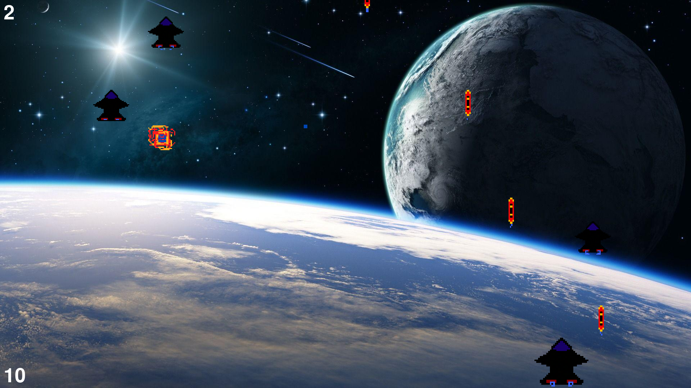

# A retro 2D space shooter built with pygame.

## Setup
1. ```git clone https://github.com/ravil-gasanov/pygame-2d-space-shooter.git```
2. Use _uv_ to create a virtual environment (venv) and install the dependencies: ```uv sync```
3. Run the game: ```uv run space_shooter\game.py```

## How to Play
1. Use arrow keys to fly
2. Press spacebar to shoot
3. Press escape to quit


