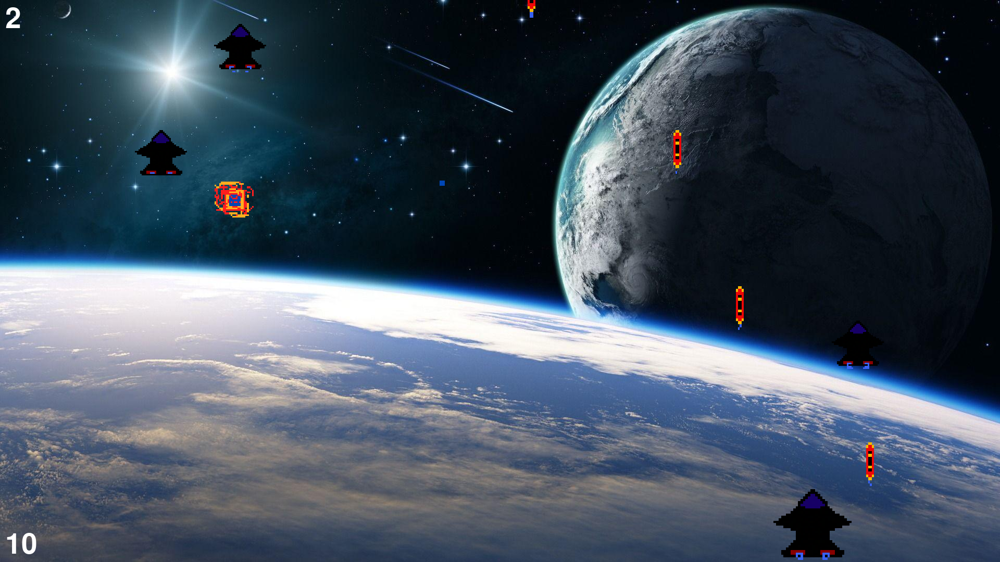

A simple 2D space shooter using pygame.

To play:
1. Download the project
2. Install pygame
3. Go to 'project_folder/src'
4. Run 'python main.py' in the command line.

The game is best enjoyed on a 16:9 display, full screen.

